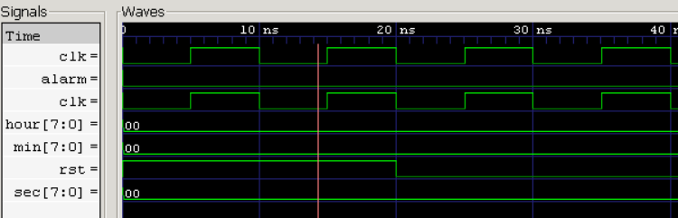
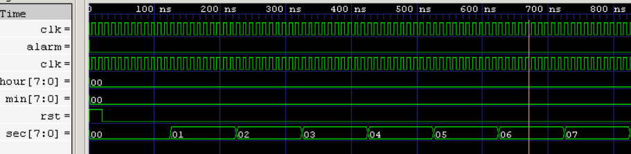
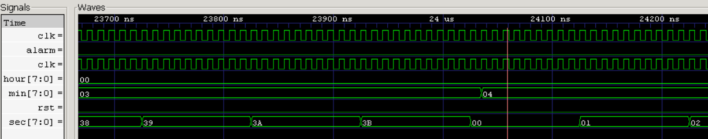
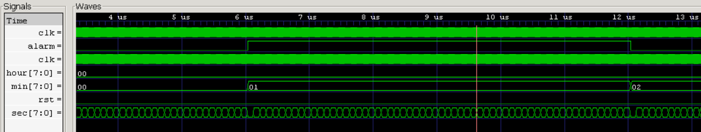
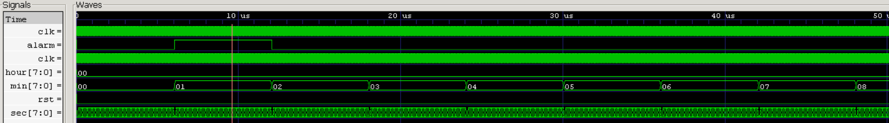

# ⏰ VLSI-Based Digital Clock with Alarm Functionality

## 📌 Overview

This project implements a **VLSI-Based Digital Clock with Alarm Functionality** using **Verilog HDL**. The design demonstrates core digital design concepts including clock division, sequential logic, counters, alarm generation, RTL design, and functional verification.

The system operates in **24-hour format**, continuously tracks **hours, minutes, and seconds**, and activates an alarm signal whenever the current time matches a user-defined alarm time.

The project is fully verified through simulation using **Icarus Verilog** and **GTKWave**, making it suitable for VLSI, FPGA, Digital Design, and Verification portfolios.

---

## 🎯 Project Objectives

* Design a digital clock using Verilog HDL
* Implement clock division and timing control
* Develop seconds, minutes, and hours counters
* Implement alarm comparison logic
* Verify functionality using simulation and waveform analysis
* Demonstrate industry-relevant RTL design methodology

---

## 🏗️ System Architecture

```text
Clock Input
    │
    ▼
Clock Divider
    │
    ▼
Seconds Counter
    │
    ▼
Minutes Counter
    │
    ▼
Hours Counter
    │
    ▼
Alarm Controller
    │
    ▼
Alarm Output
```

---

## 🚀 Features

* 24-Hour Digital Clock
* Clock Divider Design
* Seconds Counter
* Minutes Counter
* Hours Counter
* Alarm Functionality
* Modular RTL Architecture
* Verification Testbench
* GTKWave Waveform Analysis
* FPGA-Ready Design
* Industry-Oriented Project Structure

---

## 📂 Project Structure

```text
VLSI-Digital-Clock-with-Alarm/

│
├── constraints/
│   └── digital_clock.xdc
│
├── docs/
│   ├── Architecture.md
│   ├── Design_Specification.md
│   ├── FPGA_Implementation_Guide.md
│   ├── Project_Overview.md
│   ├── Verification_Plan.md
│   └── Waveform_Analysis.md
│
├── images/
│   ├── alarm_trigger.png
│   ├── clock_reset.png
│   ├── minute_rollover.png
│   └── seconds_counter.png
│
├── reports/
│   └── Project_Report.pdf
│
├── rtl/
│   ├── clock_divider.v
│   ├── bcd_counter.v
│   ├── digital_clock_core.v
│   ├── alarm_controller.v
│   ├── display_mux.v
│   ├── seven_segment_decoder.v
│   └── digital_clock_top.v
│
├── simulation/
│   └── simulation_terminal.png
│
├── tb/
│   └── digital_clock_tb.v
│
├── waveforms/
│   └── full_clock_waveform.png
│
├── README.md
└── .gitignore
```

---

## 🛠️ Tools & Technologies

### Hardware Description Language

* Verilog HDL

### Verification

* Testbench-Based Verification

### Simulation Tools

* Icarus Verilog
* GTKWave

### Development Environment

* Visual Studio Code

### Version Control

* Git
* GitHub

---

## ⚙️ RTL Modules

### clock_divider.v

Generates a slower timing pulse from the input clock.

### bcd_counter.v

Reusable counter module used for time tracking.

### digital_clock_core.v

Controls hours, minutes, and seconds counting.

### alarm_controller.v

Compares current time with alarm settings.

### seven_segment_decoder.v

Converts numerical values into seven-segment display outputs.

### display_mux.v

Provides display multiplexing support.

### digital_clock_top.v

Top-level integration module.

---

## 🔬 Verification Methodology

The design was verified using a custom Verilog testbench.

### Verification Scenarios

* Reset Verification
* Seconds Counter Verification
* Minutes Counter Verification
* Hour Counter Verification
* Alarm Trigger Verification
* Time Progression Verification
* Functional Waveform Analysis

---

## 📊 Simulation Results

### Reset Verification

The reset signal correctly initializes:

* Hours = 0
* Minutes = 0
* Seconds = 0

### Seconds Counter

Verified sequential counting:

```text
00 → 01 → 02 → 03 → ...
```

### Minute Rollover

Verified:

```text
59 → 00
```

Minute counter increments correctly.

### Hour Increment

Verified hour advancement after minute rollover.

### Alarm Trigger

Alarm output is asserted when:

```text
Current Hour = Alarm Hour
AND
Current Minute = Alarm Minute
```

---

## 📸 Waveform Results

### Clock Reset



### Seconds Counter



### Minute Rollover



### Alarm Trigger



### Full Clock Waveform



---

## ▶️ Running the Simulation

### Compile

```bash
iverilog -o clock_sim rtl/*.v tb/*.v
```

### Run

```bash
vvp clock_sim
```

### Open GTKWave

```bash
gtkwave clock.vcd
```

---

## 📈 Applications

* Digital Watches
* Alarm Clocks
* FPGA-Based Controllers
* Embedded Systems
* Consumer Electronics
* Timing Systems
* Industrial Automation

---

## 🎓 Learning Outcomes

Through this project, the following concepts were implemented and verified:

* RTL Design
* Sequential Logic
* Clock Management
* Counter Design
* Alarm Generation Logic
* Functional Verification
* Testbench Development
* Waveform Debugging
* FPGA-Oriented Design Flow

---

## 🔮 Future Enhancements

* Full HH:MM:SS Seven-Segment Display
* Time Setting Mode
* Alarm Setting Mode
* Snooze Feature
* 12-Hour / 24-Hour Mode
* FPGA Hardware Deployment
* Push Button Interface
* Buzzer Integration

---

## 👨‍💻 Author

**Vayunandan Mishra**

Electronics & Communication Engineering Graduate

Interested in:

* VLSI Design
* FPGA Development
* Digital Design
* Embedded Systems
* IoT
* Artificial Intelligence

---

## ⭐ Repository Highlights

✔ Modular Verilog RTL Design

✔ Alarm Functionality

✔ Verification Testbench

✔ GTKWave Analysis

✔ Industry-Oriented Project Structure

✔ GitHub Portfolio Project

✔ Placement & Interview Ready
